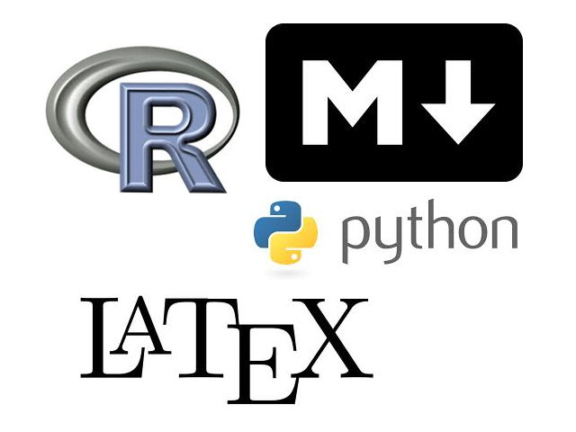

<br><br><br>
<center> 
	<font size="40"> <a href="http://bit.ly/montreal_wkshp">http://bit.ly/montreal_wkshp</a> </font> 
</center><br><br>
<center> 
	<font size="40"> Made with <a href="http://slidify.org/">Slidify</a>; the code <a href="https://github.com/SChamberlain/posterstalks/blob/gh-pages/plosalm13/index.Rmd">here</a> </font>
</center><br><br>
<center> 
	<font size="40"> Press "o" to bring up all slides - "w" to change aspect - "g" to go to page </font>
</center>

---

<br><br>
### License: CC-BY 3.0 - You are free to copy, share, adapt, or remix, photograph, film, or broadcast, blog, live-blog, or post video of this presentation, provided that you attribute the work to its author and respect the rights and licenses associated with its components.
<br><br>
### Icons: by <a href="http://fortawesome.github.io/Font-Awesome/">FontAwesome</a>

---

## Science needs to be more...

<br><br>
<div class="row"><center></img></img></center></div>

---

<br><br><br>
<font size="14">
	<center> <font color="green"> <i class="fa fa-unlock">&nbsp;Open:</i></font> to increase pace of science - most research publicly funded - etc.</center><br><br>
	<center><font color="blue"><i class="fa fa-spinner">&nbsp;Reproducible:</i></font> for yourself!, and for others (if reproducible, more confidence in results)</center>
</font>

---

## Or maybe you're really lazy (aka: you want science to be easier)

<br><br>
<center></img></center>

<a href="http://www.ebay.com/itm/M-M-Dispenser-LA-Z-BOY-RECLINER-CHAIR-with-Remote-Control-/400593996036?afsrc=1">link</a>

---

<br><br><br>
<font size="14">
	<center>What tools do we need to achieve this goal?</center>
</font>

---

## Not these!

<center></center>

---

## These!

<center></center>

---

## Data is increasingly on the web

<center></center>

---

## Connecting scientists to open data on the web
<br>
<center></center>

---

<center></center>

---

<br><br><br>
<center>
	<font size="40">Data acquisition <i class="fa fa-plus"></i> data manipulation <i class="fa fa-plus"></i> data analysis <i class="fa fa-plus"></i> data visualization <i class="fa fa-bar-chart-o"></i> - combined with tools for writing <i class="fa fa-pencil"></i> in R, including <code>knitr</code> and <code>Markdown/LaTeX</code> - make an open science workflow <i class="fa fa-spinner"></i></font>
</center>

---

<br><br><br>
<center>
	<font size="40"> <font color="blue"><strong>DATA ACQUISITION</strong></font> <i class="fa fa-plus"></i> data manipulation <i class="fa fa-plus"></i> data analysis <i class="fa fa-plus"></i> data visualization <i class="fa fa-bar-chart-o"></i> - combined with tools for writing <i class="fa fa-pencil"></i> in <code>R</code>, including <code>knitr</code> and <code>Markdown/LaTeX</code> - make an open science workflow <i class="fa fa-spinner"></i></font>
</center>

---

## Public Library of Science full text - `rplos`


```r
library(rplos)
plot_throughtime(list("reproducible science"), 500)
```


---

## Mapping biodiversity data - `rgbif`


```r
library(rgbif)
key <- name_backbone(name = "Danaus plexippus", kingdom = "animals")$speciesKey
out <- occ_search(taxonKey = key, limit = 300, return = "data")
gbifmap(out)
```


---

## Projected climate data - `rWBclimate`


```r
library(rWBclimate)
country_dat <- get_historical_temp(c("USA", "MEX", "CAN", "BLZ"), "year")
ggplot(country_dat, aes(x = year, y = data, group = locator)) + 
  theme_bw(base_size=18) + geom_point() + geom_path() + labs(y="Average annual temperature of Canada", x="Year") + 
  stat_smooth(se = F, colour = "black") + facet_wrap(~locator, scale = "free")
```


---

## Unified species occurrence data - `spocc`


```r
library(spocc)
library(rCharts)
spnames <- c("Accipiter striatus", "Setophaga caerulescens", "Spinus tristis")
out <- occlist(query = spnames, from = c("gbif", "bison"), gbifopts = list(georeferenced = TRUE))
data <- occtodfspp(out, "data")
```


Various plotting options

* rCharts: `maprcharts(data)`
* GitHub gist: `mapgist(data)`
* CartoDB: `mapcartodb(data)`
* RStudio's Shiny: `mapshiny(data)`

--- &twocol

## Workflows side by side

*** =left

### Our worklow now

* Browser
* Excel
* SAS
* SigmaPlot
* Word
* Endnote

Cost = $$$$$$$<br>
Learn = many different programs

*** =right

### What it could be

* R

Cost = <del>$$$$$$$</del><br>
Learn = 1 program

---

<br><br><br>

<font size="18"><center> This workshop on the interwebs: <a href="http://bit.ly/montreal_wkshp">http://bit.ly/montreal_wkshp</a> </center></font>
<br><br>
<font size="18"><center> <a href="http://software-carpentry.org/bootcamps/index.html#future">Montreal Software Carpentry 2 day Bootcamp</a> </center></font>

---

<br><br><br>

<font size="18"><center> rOpenSci on the web: <a href="http://ropensci.org/">http://ropensci.org/</a> </center></font>
<br><br>
<font size="18"><center><a href="https://twitter.com/ropensci"><i class="fa fa-twitter"></i> - @ropensci</a> </center></font>
